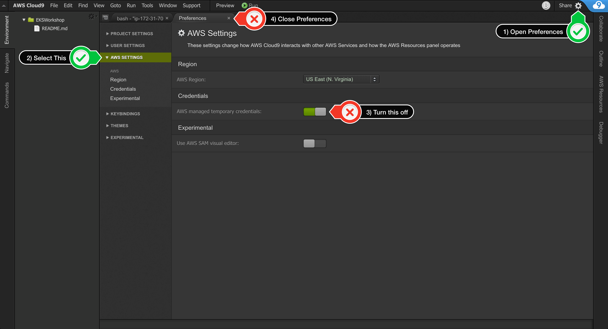

# Prereqisits

In this first excise we will create a cloud9 workspace with all EKS
tool.

## Step 1 - Create cloud9 workspace 

To have a common space for you toolings, we will use cloud9 in this
workshop. Cloud9 is a web-base editor which is place on a EC2 instance
in aws. 

To create an cloud9 Environment, please login into AWS and follow this
link: https://eu-central-1.console.aws.amazon.com/cloud9/home?region=eu-central-1

Give the environment this name: <shortname>_summercamp_workspace e.g.
pkoch_summercamp_workspace

Please use the default setting like:
* Environment type: Create a new instance for environment (EC2) 
* Instance type: t2.micro (1 GiB RAM + 1 vCPU)
* Platform: Amazon Linux

Now it will take a will till the Cloud9 Workspace will be create. 

## Step 2 - Attach Workspace Policy

Meanwhile we have to attach the fitting role to the EC2 instances.
Therefore please navigate to the EC2 section. Here you will find you EC2
instance which will be used as base for cloud9. Please Attache a EC2
instance role to have the necessary rights for further actions with
these steps:

1. Follow this deep [link](https://eu-central-1.console.aws.amazon.com/ec2/v2/home?region=eu-central-1#Instances:search=aws:cloud9:environment;sort=tag:Name) to find your Cloud9 EC2 instance
2. Select your own instance, then choose Actions / Instance Settings /
   Attach/Replace IAM Role
3. Add role: summercamp2019_eks_101_workspaceadmin
  

## Step 3 - Clone repository

Configure you git credentials to be able to clone and work with the git
repository.

First Add you ssh-key if you use ssh access for github 

     vi ~/.ssh/id_rsa
     chmod 600 ~/.ssh/id_rsa 

Second set you git user:

     git config --global user.name "<Firstname> <Lastname>"                                                                                                            
     git config --global user.email "<email address>"

Clone the git repository of the summer camp with: 

    git clone git@github.com:senacor/kubernetes-101-aws-eks.git
    
Switch to checked out Project:

    cd kubernetes-101-aws-eks

## Step 4 - Configure cloud9 workspace for EKS

To create an EKS cluster and work with it, we need a bunch of tools. To
install the tools use the sh-script for convenience. 

    ./00_Prereqisites/configure_eks_tools.sh
    
Response should look like this. 

    -
    --- Create the default ~/.kube directory for storing kubectl configuration
    -
    -
    --- Install kubectl
    -
    -
    --- Install AWS IAM Authenticator
    -
    -
    --- Install JQ and envsubst
    -
    -
    --- Verify the binaries are in the path and executable
    -
    kubectl in path
    aws-iam-authenticator in path
    jq in path
    envsubst in path

## Step 5 - Update IAM settings for your Workspace

Cloud9 normally manages IAM credentials dynamically. This isn’t
currently compatible with the aws-iam-authenticator plugin, so we will
disable it and rely on the IAM role instead.

1. Return to your workspace and click the sprocket, or launch a new tab to open the Preferences tab
2. Select AWS SETTINGS
3. Turn off AWS managed temporary credentials
4. Close the Preferences tab

 

After that run:

    ./00_Prereqisites/update_iam_role.sh
    
Validate with this Command: 

    aws sts get-caller-identity
    
Like this it should contain the role we added to the instance summercamp2019_eks_101_workspaceadmin: 

    {
        "Account": "604370441254", 
        "UserId": "AROAYZN2JCQTO2KIV45L5:i-05b78cb6a06e83234", 
        "Arn": "arn:aws:sts::604370441254:assumed-role/summercamp2019_eks_101_workspaceadmin/i-05b78cb6a06e83234"
    }
    

## Step 6 

aws ec2 import-key-pair --key-name "eks_101" --public-key-material 
file://~/.ssh/eks_101_rsa.pub
