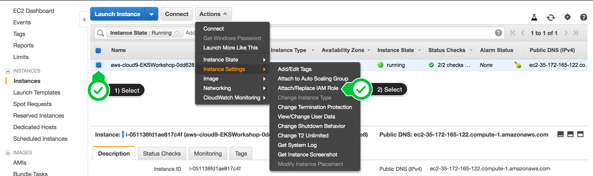

# Kubernetes Basics

In this first excise we will create a cloud9 workspace with all EKS tool
and ramp up an EKS cluster to get you up and running. 

## Step 1 - Create cloud9 workspace 

To have a common space for you toolings, we will use cloud9 in this
workshop. Cloud9 is a web-base editor which is place on a EC2 instance
in aws. 

To create an cloud9 Environment, please login into AWS and follow this
link: https://eu-central-1.console.aws.amazon.com/cloud9/home?region=eu-central-1

Give the environment this name: <shorname>_summercamp_workspace e.g. pkoch_summercamp_workspace

Please use the default setting like:
* Environment type: Create a new instance for environment (EC2) 
* Instance type: t2.micro (1 GiB RAM + 1 vCPU)
* Platform: Amazon Linux

Now it will take a will till the Cloud9 Workspace will be create. 

Meanwhile please navigate to the EC2 section. Here you will find you EC2
instance which will be used as base for cloud9. Please Attache a EC2
instance role to have the necessary rights for further actions with
these steps: 

1. Follow this deep [link](https://eu-central-1.console.aws.amazon.com/ec2/v2/home?region=eu-central-1#Instances:search=aws:cloud9:environment;sort=tag:Name) to find your Cloud9 EC2 instance
2. Select your own instance, then choose Actions / Instance Settings /
   Attach/Replace IAM Role
3. Add role: summercamp2019_eks_101_workspaceadmin
  

## Step 2 - Configure cloud9 workspace for EKS

## Step 3 - Ramp up EKS Cluster
